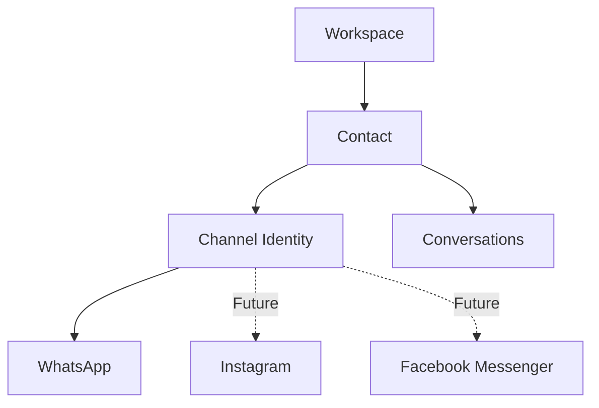

# Product Memory Governance

**Status:** Active documentation policy

This file records how `dbl-product-memory` should evolve as DBL Employee AI grows. It captures the useful ideas raised during external review of the memory repository and turns them into explicit operating rules.

## Why this repository exists

`dbl-product-memory` is the product's durable institutional memory. Its purpose is not to duplicate source code or Git history. Its job is to preserve the context that code alone cannot explain reliably:

- what the product is trying to become;
- what is currently implemented;
- why important architectural/product decisions were made;
- what alternatives were considered and rejected;
- what problems appeared and how they were solved;
- what remains intentionally deferred;
- where work stopped so that a new engineer or AI assistant can continue without reconstructing history from scratch.

A successful handoff should allow an external assistant or future team member to read the memory repository and understand the product without needing the original ChatGPT conversation history.

---

## 1. AI-ready documentation

The repository should stay intentionally easy for AI assistants and human engineers to consume.

`AI_HANDOFF.md` remains the preferred first entry point for a new assistant. It should point to the authoritative files required for the current task instead of attempting to duplicate every detail itself.

### Rule

When giving the project to Codex, Claude, Gemini, DeepSeek, Copilot, or another assistant:

1. point it to `dbl-product-memory`;
2. ask it to read `AI_HANDOFF.md` first;
3. require it to read the task-specific architecture/status documents before proposing implementation;
4. require source-code verification in `dbl-employee-ai` before treating memory documents as proof of current implementation state.

The Product Memory repository describes intent/history/state, while the application repository remains the implementation source of truth.

---

## 2. Visual architecture diagrams

Architecture documents should use Mermaid diagrams when a diagram makes relationships or data flow materially easier to understand.

Good use cases:

- entity relationships;
- migration/transition paths;
- request/data flows;
- provider authentication chains;
- state-machine transitions;
- subsystem boundaries.

### Rules

- Diagrams explain architecture; they are not executable migration instructions.
- If a diagram represents a proposed rather than approved implementation, label it clearly as **Conceptual / Pending Technical Audit**.
- Do not make a diagram more detailed than the underlying architectural decision warrants.
- Prefer one clear diagram over several decorative diagrams.

Example:



---

## 3. Architecture Decision Records (ADRs)

Important decisions should gradually move from a flat decision list into explicit Architecture/Product Decision Records.

The goal is to preserve not only **what** DBL chose, but **why** it chose it.

Recommended structure:

```text
DECISIONS/
  ADR-001-whatsapp-first-channel-ready.md
  ADR-002-knowledge-internal-approval.md
  ADR-003-vercel-oidc-google-wif.md
  ...
```

Each ADR should contain:

- title;
- status (`Proposed`, `Accepted`, `Superseded`, `Deprecated`);
- date;
- context/problem;
- decision;
- alternatives considered;
- reasons for rejecting the alternatives;
- expected consequences/trade-offs;
- links to relevant PRs, architecture files, or incidents where useful.

### ADR eligibility

Create an ADR when a decision is expensive to reverse or likely to be questioned later, such as:

- WhatsApp-first vs immediate multi-channel architecture;
- canonical Contact identity design;
- provider credential architecture;
- tenant/RLS boundary choices;
- approval/workflow semantics;
- billing model primitives;
- major infrastructure choices.

Do not create ADRs for routine UI copy, tiny refactors, or implementation details that a PR already explains sufficiently.

---

## 4. Semi-automated memory updates

Automation may help collect facts, but it must not silently rewrite product intent.

Potential future workflow:

```text
GitHub / CI events
      ↓
collect factual change metadata
      ↓
AI proposes memory update
      ↓
human / project review
      ↓
approved commit to dbl-product-memory
```

Useful candidates for automation:

- merged PR number/title/head/squash SHA;
- deployment status;
- closed blocker references;
- test/CI status summaries;
- draft CHANGELOG suggestions.

### Never automatically rewrite without review

- `VISION.md`;
- architecture decisions;
- product strategy;
- security assumptions;
- roadmap priorities;
- explanations of why decisions were made.

A commit or issue can prove that something changed; it cannot always prove the product reasoning behind that change.

Therefore DBL's policy is **semi-automated memory, not autonomous product memory**.

---

## 5. Dedicated Product Memory AI Agent

A dedicated Product Memory AI agent is a possible future enhancement, not a current priority.

The current repository already provides most of the desired value because any capable assistant can be pointed to `AI_HANDOFF.md` and the relevant files.

A dedicated agent becomes justified only if it provides measurable additional value, for example:

- continuously indexing a much larger document set;
- answering provenance-aware questions across years of product history;
- automatically preparing reviewed handoff briefs;
- enforcing documentation consistency across multiple engineering teams.

Until that need exists, building a separate memory agent would add infrastructure without solving a current bottleneck.

**Current decision:** deferred.

---

## 6. Separation from the application repository

Keep `dbl-product-memory` separate from `dbl-employee-ai`.

Benefits:

- product strategy does not clutter the application repository;
- non-code stakeholders can read product context without navigating implementation files;
- assistants can consume a curated context layer before diving into source code;
- sensitive implementation churn does not erase historical reasoning.

The separation does not mean Product Memory can contradict the code. When implementation state matters, verify current `main` in the application repository and update memory accordingly.

---

## 7. Security rules

Product Memory must never contain secret values or private customer data.

Allowed:

- environment variable names;
- secret names;
- architecture descriptions;
- masked/suffix-only identifiers where operationally useful;
- public PR/commit/deployment identifiers when safe.

Forbidden:

- API keys;
- access tokens;
- service-account private keys;
- application secrets;
- passwords;
- raw OAuth/OIDC assertions;
- customer phone numbers;
- customer message contents;
- private provider payloads.

If an incident involves secret handling, document the failure mode and remediation without copying the secret itself.

---

## 8. Documentation hierarchy

Use the smallest authoritative document for each type of knowledge:

- `AI_HANDOFF.md` → fast context for a new assistant;
- `CURRENT_STATUS.md` → current stopping point/state;
- `VISION.md` → long-term product direction;
- `ROADMAP.md` → planned sequence/priorities;
- `CONTACTS_ARCHITECTURE.md` and similar files → subsystem-specific architecture;
- `DECISIONS.md` / future `DECISIONS/ADR-*` → why major choices were made;
- `PROBLEMS_AND_SOLUTIONS.md` → notable failures and fixes;
- `CHANGELOG.md` → chronological product/engineering milestones;
- `BLOCKERS.md` → unresolved external/internal blockers.

Avoid duplicating the same paragraph across many files. Prefer links and concise summaries pointing to the authoritative document.

---

## 9. What should trigger a memory update

Update Product Memory when any of the following occurs:

- an important PR is merged;
- production behavior materially changes;
- a blocker is discovered or resolved;
- a migration changes the core data model;
- an architecture/product decision is accepted;
- an earlier decision is superseded;
- a security/infrastructure failure teaches a reusable lesson;
- the next implementation step changes;
- a future idea is important enough that forgetting it would be costly.

Do not update memory for every small commit. The repository should remain curated rather than becoming a second noisy Git log.

---

## 10. Review principle

External AI or human reviews are inputs, not automatic authority.

When DeepSeek, Gemini, Google research tools, Claude, Codex, or another reviewer suggests an improvement:

1. identify the actual problem behind the suggestion;
2. separate praise/opinion from actionable design information;
3. compare it against DBL's current architecture and product priorities;
4. adopt only the parts that improve correctness, safety, clarity, or future maintainability;
5. record accepted changes as DBL decisions, not as unfiltered reviewer commentary.

This keeps Product Memory coherent even when many advisors participate.

---

## Current accepted improvements from the Product Memory review

As of **2026-08-11**, the following improvements are accepted:

1. **Mermaid architecture diagrams** should be used where they materially improve understanding.
2. **ADRs / Decision Records** should be introduced for major architectural/product decisions.
3. **Semi-automated memory updates** are a future improvement: automation may gather facts and propose updates, but review remains required before changes to institutional memory.
4. A dedicated **Product Memory AI Agent is deferred** because the repository + `AI_HANDOFF.md` already solves the current handoff problem effectively.
5. The Product Memory repository remains **separate from the source-code repository**.
6. External reviews should be synthesized into DBL's own decisions instead of copied wholesale as authoritative truth.

